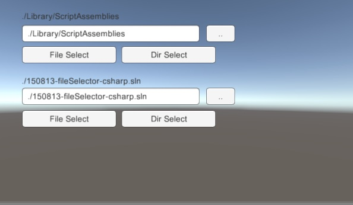

# unity-150813-fileSelector

##About 
File and Directory selector for unity-5.1.1-f1 using uGUI.

##preparation

1. add CanvasFile.prefab to the Hierarchy of the scene
2. add EventSystem if it does not exist in the Hierarchy
3. change [File Id] of {ButtonFileSel, ButtonDirSel, ButtonUpper} to differ from other CanvasFile object in the scene.

##How to use
1. input "." in the InputField
2. click [File Select] or [Dir Select] 
3. etc.

